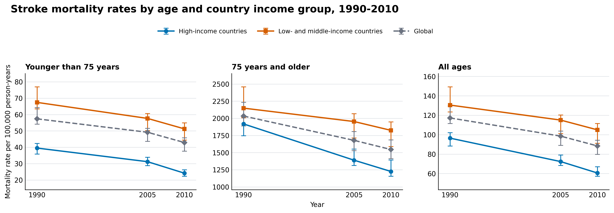

## Homework 1



Stroke mortality rates descreased from 1990 to 2010 in every age and income group. The decline was steeper in high-income countries than in low- and middle-income countries. All-age mortality decreased by 37.2% in high-income countries, compared with 19.5% in low- and middle-income countries. Among people aged over 75 years old, the corresponding decline were 36.1% and 15.1%, respectively. Overall, the mortality rates were much higher among older people aged 75 years old and older.

### Design choice

- Age groups are separated into parallel panels. Age has the largest effect on the scale of mortality. Rates among people aged 75 years and older are much higher than those in the other groups. It keeps the all income groups together within each panel, allowing direct comparisons at the same age and year. 
- Blue and orange make the high-income and low-and-middle-income groups easy to identify and compare across years. Different marker shapes provide an additional distinction. The global estimate is considered as the reference group, thus in gray dashed line. 
- The background gridlines help identify mortality rates and compare confidence intervals with the y-axis. They are light to avoid visually overlapping with the data.
- Points represent the estimated mortality rates. Lines connecting the points emphasize the changes over time, and vertical bars show the 95% confidence intervals. 
- Mortality ranges from approximately 20–80 among people younger than 75 but from about 1,000–2,500 among people aged 75 and older. A common 0–2,500 scale would flatten the younger-than-75 and all-age group, making data invisible. Thus the scales are adjusted for each age group,

### Comprehensive graph

For the comprehensive display, I would use the small-multiple matrix with five outcome rows (incidence, prevalence, mortality, MIR, and DALYs lost) and three age-group columns. Thus, the main structure would be 5 x 3 matrix, and include 15 coordinated panels. 

Every panel will use the same visual rules. Year would appear on the x-axis (1990, 2005, 2010). High-income countries are in blue circles, low- and middle-income countries are in orange squares, the global estimate by gray diamonds and a dashed line. Each point represents the point estimate with its 95% confidence interval. 

Each outcome needs an appropriate y-axis. Incidence and mortality are rates per 100,000 person-years, prevalence is measured per 100,000 people, DALYs represent health loss per 100,000 people, and MIR is a unitless ratio. MIR would use a common 0-1 scale, while the other outcome rows would use ranges appropriate to their values.
 
### Appendix

```python
import matplotlib.pyplot as plt
import pandas as pd
df = pd.read_csv("feigin2014_table1_mortality.csv")

plt.rcParams.update(
    {
        "font.family": "DejaVu Sans",
        "font.size": 10,
        "axes.titlesize": 11,
        "axes.labelsize": 10,
        "legend.fontsize": 9,
    }
)


age_order = ["<75", ">=75", "all"]
age_labels = {
    "<75": "Younger than 75 years",
    ">=75": "75 years and older",
    "all": "All ages",
}

group_order = ["high", "low_and_middle", "all"]
group_labels = {
    "high": "High-income countries",
    "low_and_middle": "Low- and middle-income countries",
    "all": "Global",
}

styles = {
    "high": {"color": "#0072B2", "marker": "o", "linestyle": "-"},
    "low_and_middle": {"color": "#D55E00", "marker": "s", "linestyle": "-"},
    "all": {"color": "#6B7280", "marker": "D", "linestyle": "--"},
}


fig, axes = plt.subplots(1, 3, figsize=(13.4, 4.8), sharex=True)


for ax, age in zip(axes, age_order):
    panel = df[df["age_group"] == age]

    for group in group_order:
        z = panel[panel["income_group"] == group].sort_values("year")

        yerr = [
            z["mortality_rate"] - z["interval_low"],
            z["interval_high"] - z["mortality_rate"],
        ]

        ax.errorbar(
            z["year"],
            z["mortality_rate"],
            yerr=yerr,
            linewidth=2.0,
            markersize=5.5,
            capsize=3.5,
            capthick=1.1,
            elinewidth=1.2,
            label=group_labels[group],
            **styles[group]
        )

    ax.set_title(age_labels[age], loc="left", weight="bold")
    ax.set_xticks([1990, 2005, 2010])
    ax.grid(axis="y", color="#D1D5DB", linewidth=0.7, alpha=0.75)
    ax.spines[["top", "right"]].set_visible(False)
    ax.tick_params(axis="both", length=0)
    ax.margins(x=0.08, y=0.15)

axes[0].set_ylabel("Mortality rate per 100,000 person-years")
axes[1].set_xlabel("Year")

handles, labels = axes[0].get_legend_handles_labels()
fig.legend(
    handles,
    labels,
    loc="upper center",
    bbox_to_anchor=(0.5, 0.91),
    ncol=3,
    frameon=False,
    handlelength=2.6,
    columnspacing=1.8,
)

fig.suptitle(
    "Stroke mortality rates by age and country income group, 1990-2010",
    x=0.06,
    y=0.99,
    ha="left",
    fontsize=15,
    weight="bold",
)

fig.tight_layout(rect=[0.04, 0.08, 0.995, 0.84], w_pad=2.4)

# Save figure and render in notebook
fig.savefig(
    "feigin_mortality_rates.png", dpi=300, bbox_inches="tight", facecolor="white"
)
plt.show()
```